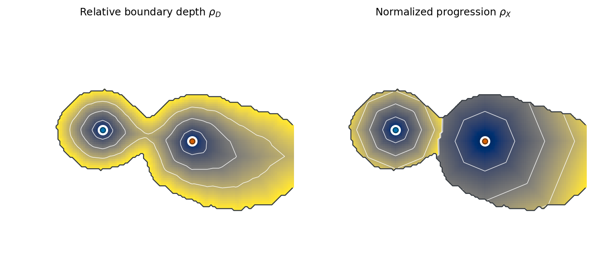

# RadialPaths

**Centre-conditioned radial profiles for irregular structures**

Developed by [Rafael S. de Souza](https://rafaelsdesouza.com.br/).

RadialPaths constructs support-constrained radial geometry from a connected
mask and supplied centres. Build the geometry once, then measure any registered
scalar field—surface brightness, colour, velocity, age, metallicity, or another
pixel-aligned tracer—without redefining radial position.



> RadialPaths 0.1.0 is the first release candidate. PyPI and Zenodo
> publication remain subject to final approval.

[Open the explorer](https://rafaelsdesouza.com.br/radialpaths/explorer/) ·
[Read the tutorial](https://rafaelsdesouza.com.br/radialpaths/tutorial/) ·
[Open the quick start in Colab](https://colab.research.google.com/github/RafaelSdeSouza/radialpaths/blob/v0.1.0/examples/01_quickstart.ipynb)

## Installation

Install the tagged release candidate from its immutable source:

```bash
python -m pip install --upgrade pip
python -m pip install "radialpaths @ git+https://github.com/RafaelSdeSouza/radialpaths.git@v0.1.0"
```

After PyPI publication, the installation command is:

```bash
python -m pip install radialpaths
```

For plotting and the optional local Panel explorer:

```bash
python -m pip install ".[demo]"
```

## Quick start

```python
from radialpaths import build_geometry, radial_profile

geometry = build_geometry(
    support=mask,
    centres=[(42, 31), (58, 74)],  # (row, column)
)

brightness = radial_profile(image, geometry, coordinate="rho_D")
colour = radial_profile(colour_map, geometry, coordinate="rho_X")
velocity = radial_profile(velocity_map, geometry, coordinate="rho_X")

print(brightness.median)  # shape: (n_centres, n_bins)
```

The default profile estimator is the validated observational estimator from
the paper: 30 equal bins on `[0, 1]`, `rho = 1` in the final bin, bins with
fewer than six pixels omitted, and an unweighted median per centre-associated
region.

## Coordinates

For support `Omega`, supplied centre `c_k`, and support-constrained pixel-graph
distance `d_G`:

- `rho_D = d_k / (d_k + b)` measures relative centre–boundary depth;
- `rho_X = d_k / L_k` measures normalized progression within region `B_k`;
- `L_k` is the maximum centre distance in `B_k`.

The implementation intentionally reproduces the paper's validated 8-neighbour
pixel graph. It does not silently substitute Euclidean distance or a continuous
fast-marching solver.

## From an image to the formal inputs

Image preparation remains separate from the radial construction. The reference
procedure returns its background estimate, smoothed image, provisional support,
ranked centre candidates, selected centres, and final connected support.

```python
from radialpaths.preprocessing import prepare_image

prepared = prepare_image(
    image,
    error=error_image,
    psf_fwhm=3.74,  # pixels
    n_centres=2,
    preset="paper",
)
geometry = build_geometry(prepared.support, prepared.centres)
```

The local maxima are centre candidates, not inferred physical nuclei. Users
with an external segmentation or independently measured centres can continue
to call `build_geometry(my_mask, my_centres)` directly.

## Browser demonstration

An interactive browser-based demonstration of RadialPaths is available at
<https://rafaelsdesouza.com.br/radialpaths/>. Its geometry and profile
calculations are implemented in browser-native JavaScript, require no Python
runtime in the page, and upload no image or measurement. The static tutorial
remains readable without JavaScript and links to the notebook.

The package has not been published to PyPI or Zenodo.

## Run the browser site locally

```bash
python -m pip install ".[docs,site]"
sphinx-build -W --keep-going -b html docs docs/_build/html
python tools/build_pages.py --output _site
python -m http.server 8000 --directory _site
```

The explorer provides seven support geometries, one to four supplied centres,
draggable centre markers, simultaneous coordinate fields, pixel-level path and
distance inspection, and an animated profile-construction diagnostic. The
Python implementation remains authoritative; automated fixtures check the
browser calculations against it.

## Documentation

- `docs/getting_started.rst` — installation and a first radial-profile measurement
- `docs/concepts.rst` — mathematical definitions and coordinate interpretation
- `docs/implementation_audit.md` — relationship between the public API and the paper-reproduction fixtures
- `docs/design_notes.md` — geometry reuse and interactive-explorer design
- `docs/name_release_gate.md` — final name audit and migration record
- `docs/preprocessing.rst` — inspectable image-to-support preparation
- `examples/01_quickstart.ipynb` — support, geometry, and a first profile
- `examples/02_understanding_coordinates.ipynb` — coordinate interpretation with an internal boundary
- `examples/03_your_own_image.ipynb` — image-to-profile tutorial
- `examples/04_registered_tracers.ipynb` — geometry reuse across scalar fields

## Citation

Until the accompanying paper has final bibliographic metadata, cite the
software using `CITATION.cff` and include the software version. See
`docs/citing.rst`.

## License

Copyright (c) 2026, Rafael S. de Souza and contributors. Released under the
BSD 3-Clause licence; see `LICENSE`.

Project author: [Rafael S. de Souza](https://rafaelsdesouza.com.br/).
